# Racing Game Flowchart (Mermaid Format)

```mermaid
flowchart TD
    Start([Start]) --> Init[Initialize pygame and constants<br/>SCREEN_WIDTH, SCREEN_HEIGHT, colors]
    Init --> Display[Set up display and clock<br/>screen, caption, clock]
    Display --> ClassDef[Define Car class<br/>Methods: __init__, move, draw, get_rect]
    ClassDef --> FuncDef[Define check_collision function]
    FuncDef --> MainStart[Main function start]
    MainStart --> InitVars[Initialize variables:<br/>player, enemy_cars, score,<br/>font, road_offset, running=True]
    InitVars --> GameLoop{Main game loop<br/>while running}
    
    GameLoop -->|running=True| Events[Handle events<br/>pygame.event.get]
    Events --> QuitCheck{QUIT event?}
    QuitCheck -->|Yes| SetRunningFalse[running = False]
    SetRunningFalse --> EndLoop[Exit loop]
    QuitCheck -->|No| HandleKeys[Get pressed keys<br/>pygame.key.get_pressed]
    
    HandleKeys --> LeftKey{LEFT key<br/>pressed?}
    LeftKey -->|Yes| MoveLeft[player.x -= 7]
    LeftKey -->|No| RightKey{RIGHT key<br/>pressed?}
    MoveLeft --> RightKey
    RightKey -->|Yes| MoveRight[player.x += 7]
    RightKey -->|No| SpawnCheck{Random spawn?<br/>random.randint 1,20 == 1}
    MoveRight --> SpawnCheck
    
    SpawnCheck -->|Yes| SpawnEnemy[Create new enemy car<br/>at random x position]
    SpawnCheck -->|No| MoveEnemies[Loop through enemy_cars]
    SpawnEnemy --> MoveEnemies
    
    MoveEnemies --> MoveEnemy[enemy.move<br/>enemy.y += speed]
    MoveEnemy --> OffScreen{Enemy car<br/>off screen?}
    OffScreen -->|Yes| RemoveEnemy[Remove enemy<br/>score += 1]
    OffScreen -->|No| CheckMoreEnemies{More enemies<br/>to move?}
    RemoveEnemy --> CheckMoreEnemies
    CheckMoreEnemies -->|Yes| MoveEnemy
    CheckMoreEnemies -->|No| CollisionLoop[Loop through enemy_cars<br/>for collision check]
    
    CollisionLoop --> Collision{check_collision<br/>player, enemy?}
    Collision -->|Yes| GameOver[Render GAME OVER screen<br/>Display final score]
    GameOver --> Wait[Wait 3 seconds<br/>pygame.time.wait 3000]
    Wait --> SetRunningFalse
    
    Collision -->|No| MoreCollisions{More enemies<br/>to check?}
    MoreCollisions -->|Yes| CollisionLoop
    MoreCollisions -->|No| Draw[Draw everything]
    
    Draw --> FillScreen[Fill screen with WHITE]
    FillScreen --> DrawRoad[Draw road lines<br/>Update road_offset<br/>Add shake effect]
    DrawRoad --> DrawPlayer[Draw player car]
    DrawPlayer --> DrawEnemies[Draw all enemy cars]
    DrawEnemies --> DrawScore[Draw score text]
    DrawScore --> UpdateDisplay[pygame.display.flip]
    UpdateDisplay --> ClockTick[clock.tick 60 FPS]
    ClockTick --> GameLoop
    
    GameLoop -->|running=False| Quit[pygame.quit<br/>sys.exit]
    EndLoop --> Quit
    Quit --> End([End])
```

## Program Flow Description

### Initialization Phase
1. **Start**: Program begins execution
2. **Initialize pygame**: Set up pygame library and define constants (screen dimensions, colors)
3. **Display setup**: Create game window with title "Racing Game" and clock for FPS control
4. **Class/Function definitions**: Define Car class and check_collision function

### Main Function
5. **Initialize variables**: Create player car, empty enemy list, score counter, font, and control variables
6. **Enter main game loop**: Begin the continuous game loop

### Game Loop (repeats until game over)
7. **Event handling**: Check for quit events
8. **Player movement**: Process keyboard input (LEFT/RIGHT arrows) to move player car
9. **Enemy spawning**: Randomly spawn new enemy cars at the top of the screen
10. **Enemy movement**: Move all enemy cars downward, remove off-screen cars, increment score
11. **Collision detection**: Check if player collides with any enemy car
    - If collision: Display game over screen, wait, then exit
    - If no collision: Continue to rendering
12. **Rendering**: Draw background, road lines, player, enemies, and score
13. **Display update**: Refresh screen and maintain 60 FPS
14. **Loop back**: Return to step 7

### Exit Phase
15. **Quit pygame**: Clean up and exit program

## Key Components

### Car Class
- **Attributes**: x, y, width, height, color, speed, is_player
- **Methods**: 
  - `move()`: Updates position for non-player cars
  - `draw()`: Renders car on screen
  - `get_rect()`: Returns collision rectangle

### Main Game Elements
- **Player car**: Blue car controlled by arrow keys
- **Enemy cars**: Red cars that move downward automatically
- **Score system**: Increments when enemy cars pass off screen
- **Collision detection**: Ends game when player hits enemy
